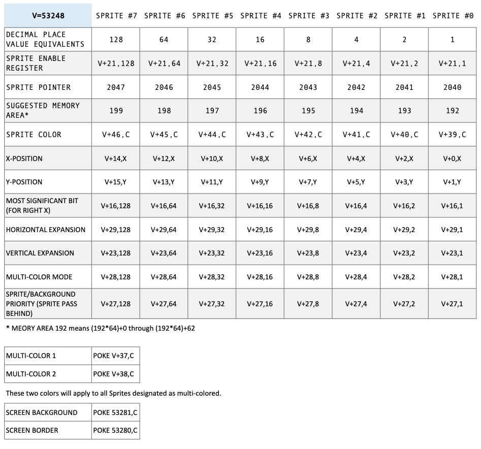

# Sprites

## Commodore 64 color codes

| Dec | Hex | Colour      |
| --- | --- | ----------- |
| 0   | $00 | black       |
| 1   | $01 | white       |
| 2   | $02 | red         |
| 3   | $03 | cyan        |
| 4   | $04 | purple      |
| 5   | $05 | green       |
| 6   | $06 | blue        |
| 7   | $07 | yellow      |
| 8   | $08 | orange      |
| 9   | $09 | brown       |
| 10  | $0A | pink        |
| 11  | $0B | dark grey   |
| 12  | $0C | grey        |
| 13  | $0D | light green |
| 14  | $0E | light blue  |
| 15  | $0F | light grey  |

## Sprite Registers

